# Theory

  

## 1. Bitcoin

  

Bitcoin is a cryptocurrency that allows people to send value (in Bitcoin) to one another by recording transactions on a public distributed ledger called a blockchain. In this section, various aspects of Bitcoin technology will be explained including how Bitcoin uses public-private key cryptography to protect a users access to their funds, how Bitcoin transactions work, how they are verified and how a blockchain is used to store these transactions. This section will also include the details of how Bitcoin technology can be used to form payment channels between users and then how payment channels can be used to create a Lightning Network.

  

### 1.1 Elliptic Curve Cryptography

Elliptic curve cryptography makes use of maths on an elliptic curve using numbers defined over a finite field [2]. Figure 1 shows the Bitcoin elliptic curve plotted over real-numbers. On such a curve, point scalar multiplication is easy to calculate but point scalar division is impossibly hard to calculate.

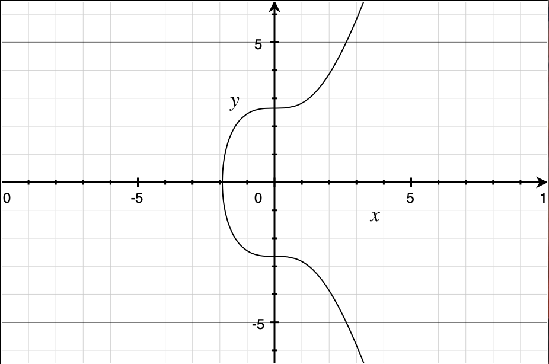
<label>Figure 1: Bitcoin Curve</label>

For example, if a publicly known generator point on the curve is *G=(gx, gy)* and this point is then multiplied by a constant *k* then another point on the curve can be found: *P=(px, py)*. Due to the fact that this maths is evaluated over a finite field, it is easy to find point *P* if both *G* and *k* are known but it is not known how to calculate *k* if *P* and *G* are known. This asymmetric property is illustrated in figure 2.

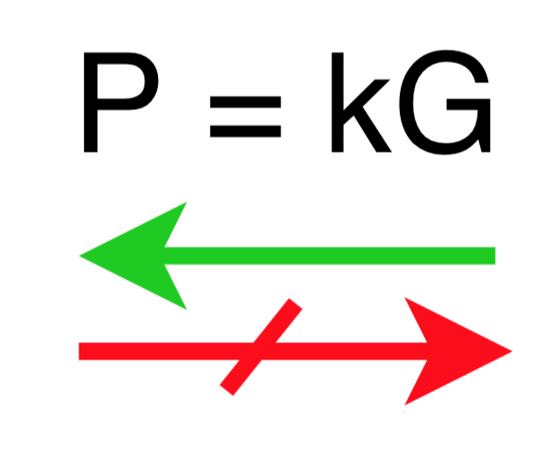
<label>Figure 2: Public-private key asymmetric property</label>

Bitcoin uses public-private key cryptography based on this asymmetric property [2]. Each Bitcoin user has a private-key, *k*, which they use to produce a public-key, *P*. The public-key can be shared without the risk of an attacker being able to determine the private-key, *k*.

  
Bitcoin users can use their private-key to sign and therefore spend the outputs of transactions that were addressed to their public-key and anyone can see this signature and verify that it was produced by the person with access to the private-key that generated the public-key, *P*, and they can do this verification without knowing the private-key, *k*.

 
### 1.2 Transactions

 
Bitcoin coins are chains of transactions that represent changes in ownership of the coins. Each transaction is made up of inputs and outputs. The inputs of a transaction point to previously unspent transaction outputs and include a signature to sign the spending of these outputs. The outputs of a transaction include the public-key addresses to which the inputs should be paid to. These outputs will only be spendable by an entity who owns the private-key that produces the public-key in the output and this is done by creating a valid signature [1].

Figure 3 shows an example of the transactions involved if a user, Alice, wanted to pay another user, Bob. In this example Alice has private-key *k1* with which she produced her public-key, *P1* and Bob has private-key, *k2*, with which he produced public-key, *P2*. To pay Bob, Alice creates transaction TX2. TX2 has an input that references the output of transaction TX1 and Alice is able to sign this input due to the fact that the output in TX1 is addressed to her public key, *P1*. Since she owns the private-key that produced *P1* she is able produce a valid signature which Bob can then verify. Alice constructs the output of TX2 so that it is spendable by anyone who has the private-key corresponding to public-key *P2* which in this case would enable Bob to spend this output.

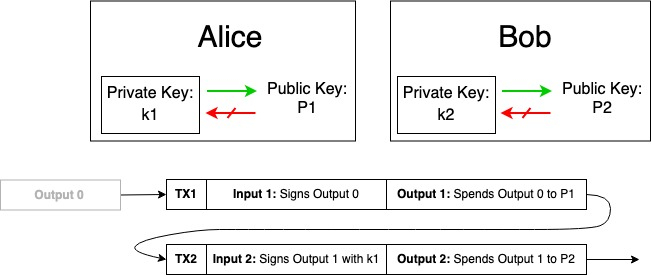
<label>Figure 3: Transactions</label>

A different type of transaction called a multi-signature (multi-sig) transaction can also be formed. The output of such a transaction would require multiple signatures in order to be valid. Figure 4 shows an example of such a transaction. In this example, the multi-sig transaction is transaction TX2 and the parties involved are Alice, with keys *P1* and *k1*, and Bob, with keys *P2* and *k2*. This transaction has two inputs, one of which references an output spendable by Alice and the other an output spendable by Bob. The output of the transaction is a 2-of-2 multi-sig script than is only spendable if the input that references it is signed by both Alice and Bob [1][2]. This type of transaction forms the basis of payment channels which are explained in section 1.4.

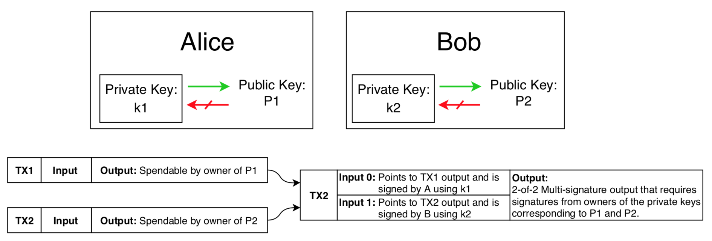
<label>Figure 4: Multi-sig Transaction</label>

### 1.3 Blockchain

For a Bitcoin transaction to be valid, it must be broadcast to the entire Bitcoin network and this is done by including transactions in the blocks of a public blockchain. This enables any user of the system to validate any transaction and trace back the origins of the transaction inputs as can be seen in figure 4. For a transaction to be included into a block and mined,  it is necessary to incentives the miners by means of transaction fees. In the Bitcoin network, it takes approximately 10 minutes for a block to be mined and added to the blockchain. For these reasons publishing a transaction on the blockchain (an on-chain transaction) is both costly and slow. Using on-chain transactions for micropayment transactions is thus not feasible nor scalable [1]. Payment channels provide a way to perform fast and cheap off-chain transactions and these are discussed next.

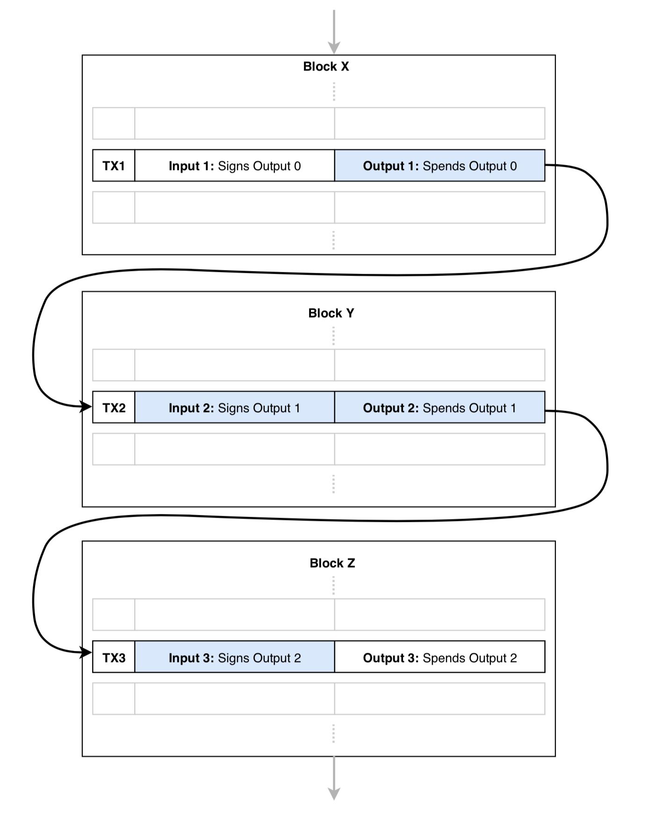
<label>Figure 4: Blockchain</label>

### 1.4 Payment Channels

Payment channels provide a way for two parties to exchange an unlimited number of Bitcoin transactions and do so off-chain. In this section, the aim is to explain the basic setup and use of a payment channel. All details of these steps can be found in reference [1].

#### Step 1

Two parties, *A* and *B*, decide to set up a payment channel and do this by each of them committing funds to a 2-of-2 multisig (see section 1.2). Both parties sign this transaction and then broadcast it to the blockchain as an on-chain, funding transaction. This transaction and the future settlement transaction will be the only two transactions that need to be published to the blockchain. In the example in figure 5.1, *A* commits 10 satoshis and *B* commits 5 satoshis to the channel.

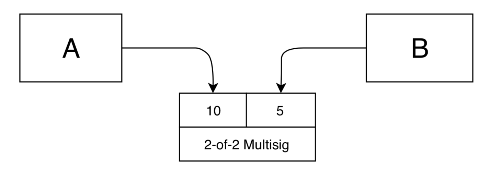
<label>Figure 5.1: Payment channels step 1</label>

#### Step 2

Once the funding transaction is mined in a block, off-chain exchanges between *A* and *B* can start. In the example shown in figure 5.2, *A* decides to pay *B* 1 satoshi and so creates a commitment transaction that spends the funding transaction output and creates one output that pays 9 satoshis to *A* and another that pays 6 satoshis to *B*. *A* signs this transaction and sends it to *B*.

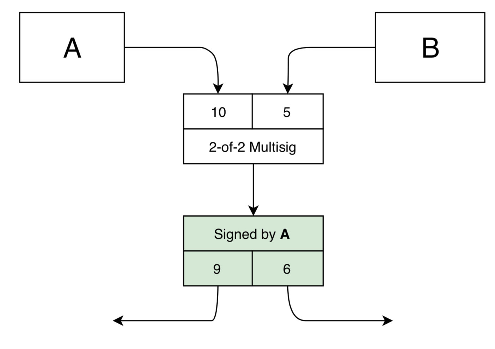
<label>Figure 5.2: Payment channels step 2</label>

#### Step 3

*B* can analyse the commitment transaction and see that it would pay him 1 satoshi more than he had. *B* then signs the transaction and sends it back to *A*. Both *A* and *B* now hold the valid commitment transaction that would correctly pay *A* and *B* if it were to be broadcast to the blockchain. But instead of broadcasting it, both parties store it and agree to update the channel state to reflect the new commitment transaction. Both parties have the ability to broadcast the valid commitment transaction to the blockchain if necessary. See figure 5.3.

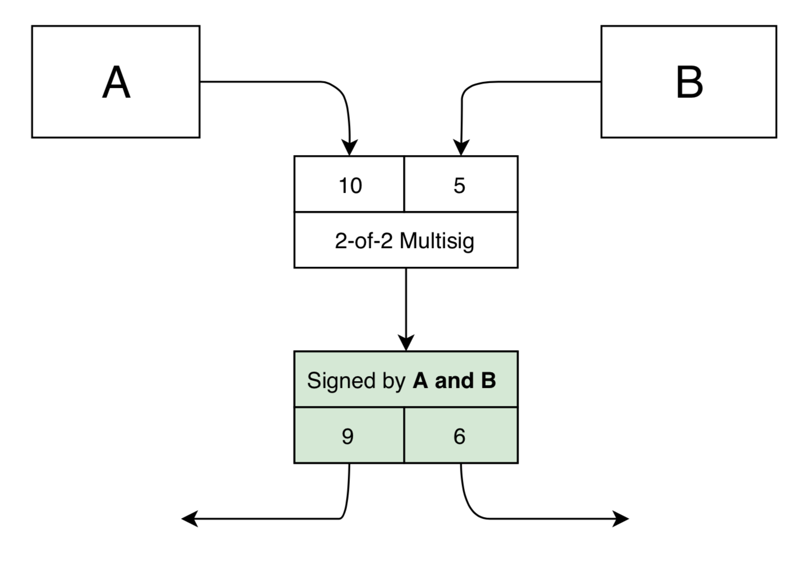
<label>Figure 5.3: Payment channels step 3</label>

#### Step 4

If *A* want to pay *B* another 1 satoshi, then *A* creates a new commitment transaction which spends the same funding transaction and repeats the process of step 2 and 3. When *A* and *B* both sign the new commitment transaction then the previously created commitment transactions are made to be invalid (this is done using asymmetric revocation commitments which will not be discussed here). Both parties then store the new, valid commitment transaction and update the channel state accordingly. See figure 5.4.

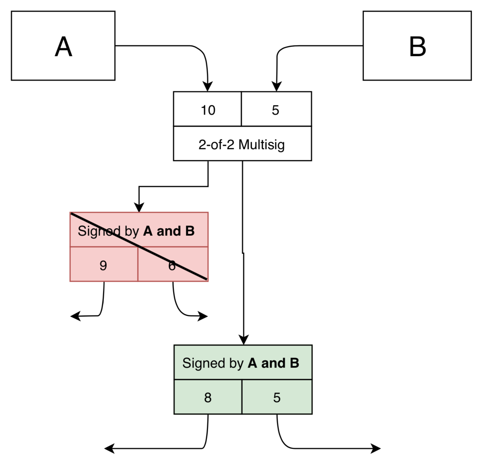
<label>Figure 5.4: Payment channels step 4</label>

Using payment channels, parties can create an endless number of commitment transactions to pay each other back and forth and can do so without needing to consult the blockchain.

### 1.4 The Lightning Network

The Lightning Network is made up of nodes connected by payment channels and enables micropayments to occur between any two nodes on the network as long as there is a path of payment channels between these nodes. The Lightning Network uses a combination of payment channel technology and a type of smart contract called a Hash Time Lock Contract (HTLC). A simple example will be used to explain how the Lighting Network can be used for secure payments across the peer-to-peer network. The details of this section can be found in [1].

#### Example

In this example, the following assumptions can be made. See Figure 6.1 for a visualisation of the initial set-up.

* Party *A* wants to pay party *C* 10 satoshis
* Payment channels exists between *A* and *B* (100 to *A* and *20* to B) and another between *B* and *C* (50 to *B* and 10 to *C*)
* *B* charges a 5 satoshi routing fee
* *A* has the hash, *H*, which is the hash of a secret pre-image value, *X*, such that *H* = hash(*X*)
* *A* knows that *C*, and only *C*, has access to *X*.
* The initial total wallet balances of each node is as follows:
* *A*: 100 satoshis
* *B*: 20 + 50 = 70 satoshis
* *C*: 10 satoshis

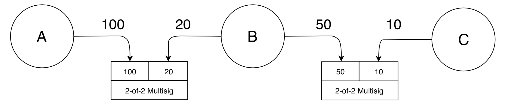
<label>Figure 6.1: Multi-hop payment set-up</label>

  
#### Step 1

*A* creates a new commitment transaction with *B*. This commitment transaction spends the funding transaction of the *A-B* channel and has three outputs:

* **Output 1**: 20 satoshi to *B*
* **Output 2**: 85 satoshi to *A*
* **Output 3**: 15 satoshi to a HTLC that has two clauses and will be spendable by which ever clauses condition is first satisfied. The first clause pays *B* if *B* is able to produce the pre-image of *H*. The second clause refunds *A* if a certain time period, *t*, has passed.

*A* signs this commitment transaction and presents it to *B*. See figure 6.2 for an illustration of this step.

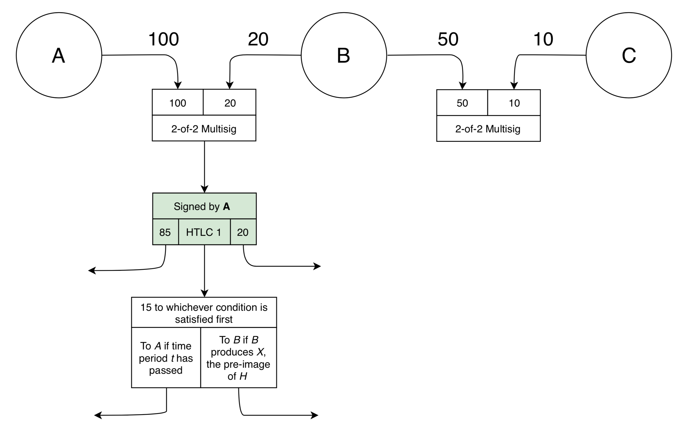
<label>Figure 6.2: Multi-hop payment step 1</label>

#### Step 2

Entity *B* will sign the commitment transaction proposed by *A* as it is clear that no money will be lost if it is not able to produce the hash pre-image and that it will gain 15 satoshis if it is able to produce the pre-image. *B* then repeats a similar process with node *C* and sets up a commitment transaction that spends the funding transaction of the *B-C* channel. The outputs of this transaction are as follows:

* **Output 1:** 10 satoshi to *C*
* **Output 2:** 40 satoshi to *B*
* **Output 3:** 10 satoshi to a HTLC that has two clauses and will be spendable by which ever clauses condition is first satisfied. The first clause pays *C* if *C* is able to produce the pre-image of *H*. The second clause refunds *B* if a certain time period, *t*, has passed.

*B* signs this commitment transaction and presents it to *C*. See figure 6.3 for an illustration of this step.

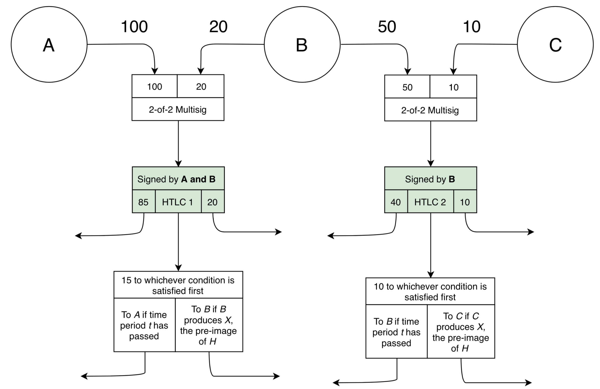
<label>Figure 6.3: Multi-hop payment step 2</label>

  

#### Step 3

*C* receives the commitment transaction proposed by *B* and sees that it is safe to sign since *C* has access to the pre-image of *H*, *X*,  and can thus claim the corresponding HTLC output. *C* signs the transaction and sends it back to *B* along with *X* so that *B* can see that C can claim the 10 satoshi committed to the HTLC. Both *B* and *C* update their channel state to reflect this. See figure 6.4 for an illustration of this step.

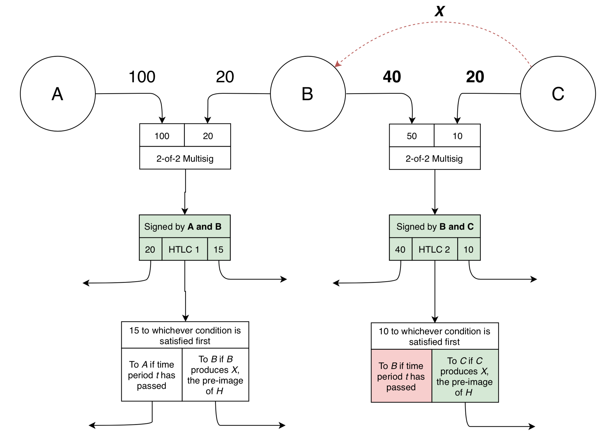
<label>Figure 6.4: Multi-hop payment step 3</label>

#### Step 4

*B* receives pre-image, *X*, from *C* and sees that it is now able to claim the 15 satoshis locked to the HTLC output form the commitment transaction proposed by *A*. *B* then sends *X* to *A* and both *A* and *B* update their channel state to reflect the payments.  See figure 6.5 for an illustration of this step.

The final total wallet balances are now as follows:

* *A*: 85 satoshis
* *B*: 35 + 40 = 70 satoshis
* *C*: 20 satoshis

It is clear that *C* has made 10 satoshis, that *B* has made 5 satoshis in routing fees and that *A* has spent 15 satoshis and has successfully paid *C* 10 satoshis.

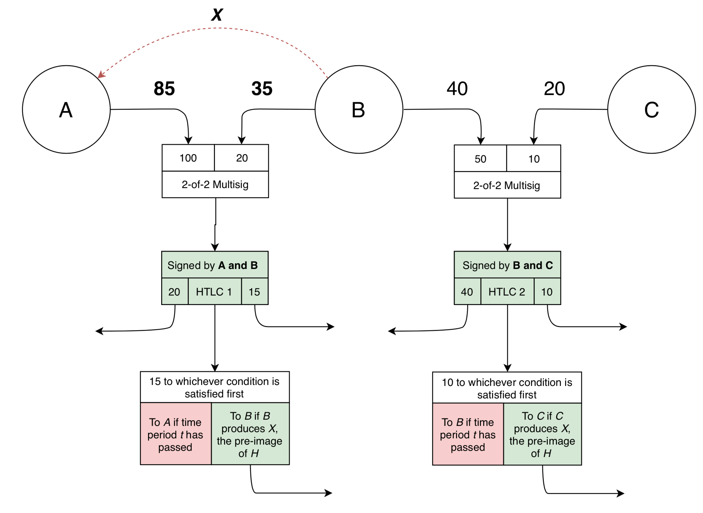
<label>Figure 6.5: Multi-hop payment step 4</label>

  

[1] Andreas M. Antonopoulos.Mastering Bitcoin. ISBN 9781491954386. O’ReillyMedia, 2017

[2] Jimmy Song.Programming Bitcoin. ISBN 9781492031499. O’Reilly Media, 2017
<!--stackedit_data:
eyJoaXN0b3J5IjpbMTA4NzI5MzQ3OCw4Mjc5MDgyMTgsLTQxMD
g5NTI2MCwtNzgxNjI2OTk1LC0xNzk5NDYyMDM5LC05NzYzNzUz
MzgsLTIwODIzNDkwNzMsMTQ1MjQyNTY1NywxNDU1OTQxMjYwLD
E4NTU3Njk1NjNdfQ==
-->